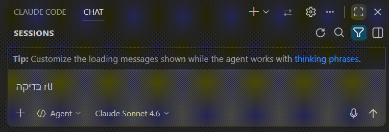
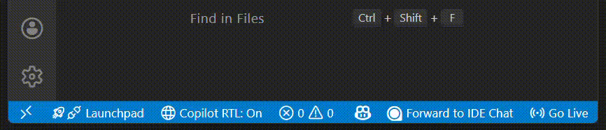

# GitHub Copilot Chat RTL Support

> **Adds an ⇄ toggle button to GitHub Copilot Chat that instantly switches messages to right-aligned RTL for Hebrew, Arabic & Persian — while keeping code blocks and UI elements in LTR. Works in VS Code, Cursor & Antigravity.**

---

## 🌐 Languages | שפות | اللغات | زبان‌ها

| | Language | Quick Links |
|---|---|---|
| 🇺🇸 | English | [View Extension Explanation ↓](#english) |
| 🇮🇱 | עברית | [להסבר על התוסף בעברית ↓](#hebrew) |
| 🇸🇦 | عربية | [لشرح الملحق بالعربية ↓](#arabic) |
| 🇮🇷 | فارسی | [برای توضیح افزونه به فارسی ↓](#persian) |

---

### 🎬 Demo

RTL <strong>⇄</strong> Button

 

 Status Bar

[🔝 Back to top](#github-copilot-chat-rtl-support)

## 🇺🇸 English

A VS Code extension that adds Right-to-Left (RTL) text direction support to the **GitHub Copilot Chat** interface. Designed for Hebrew, Arabic, and Persian speakers who want natural text alignment when chatting with Copilot — without affecting code blocks or UI elements.

### 🤔 Why is this needed?

GitHub Copilot Chat lacks native RTL support. This often results in:

- ❌ Hebrew, Arabic, and Persian text appearing misaligned
- ❌ Difficulty reading mixed-language conversations (code + RTL text)
- ❌ Inconsistent UI behavior in the chat panel

The **GitHub Copilot Chat RTL Support** extension fixes these issues by injecting CSS into the IDE's workbench to handle text direction — while strictly preserving LTR for code blocks, editor results, and attached contexts.

### ✨ Features

| Feature | Description |
|---|---|
| ▶️ Activate RTL | Injects CSS and a toggle button into the Copilot Chat interface |
| ⏹️ Deactivate RTL | Restores original files from backup |
| 🔍 Check Status | Shows which IDE installations have RTL enabled |
| 📊 Status Bar | Shows current RTL state at a glance — click to toggle |
| 🔄 Auto-reactivate | Automatically restores RTL after IDE updates |
| 🔓 No [Unsupported] | Automatically removes the checksum to prevent the `[Unsupported]` badge |

---

### 📋 Requirements

- **VS Code**, **Cursor**, or **Antigravity** IDE
- **GitHub Copilot Chat** extension installed (optional — RTL rules simply won't apply if not present)

---

### 💻 Supported Platforms

| 🛠️ IDEs |
|---|
| VS Code |
| Cursor |
| Antigravity |

---

### 🚀 How to Use

#### 📊 Option 1: Status Bar

After installation, a status bar item appears at the bottom of your IDE:

| Status | Meaning |
|---|---|
| `Copilot RTL: On` ✅ | RTL is injected and active |
| `Copilot RTL: Off` ⭕ | RTL is not active |
| `Copilot RTL: N/A` ❌ | IDE installation not found |

**Click the status bar item** to toggle RTL on or off (a confirmation will appear).

#### 🎯 Option 2: Command Palette

Press `Ctrl+Shift+P` (or `Cmd+Shift+P` on macOS) and search for:

| Command | Action |
|---|---|
| `Copilot Chat RTL: Activate RTL` | ▶️ Enable RTL support |
| `Copilot Chat RTL: Deactivate RTL` | ⏹️ Disable RTL and restore original files |
| `Copilot Chat RTL: Check Status` | 🔍 View installation status |

> ⚠️ **Important:** After Activate / Deactivate, you must **fully quit the IDE** (File → Exit) and reopen it. Developer: Reload Window is often not enough because the workbench files are loaded from disk at startup.

#### 💬 Using RTL in Chat

After activating RTL and restarting:

1. Open the GitHub Copilot Chat panel
2. Click the **⇄** button in the chat header
3. The interface switches to RTL — text aligns to the right
4. Click again to return to LTR

> 💡 **Tip:** The ⇄ button applies RTL to all chats at once. When you don't need RTL, click it again to switch back to normal mode.

> 🔄 **Auto-reactivate:** If your IDE updates and replaces its workbench files, RTL is automatically re-injected on the next startup. If it doesn't restore automatically, run **Copilot Chat RTL: Activate RTL** manually.

---

### ↔️ What Changes in RTL Mode?

| ✅ Becomes RTL | 🔒 Stays LTR |
|---|---|
| User messages | Code blocks |
| Copilot's text responses | Code editor results |
| Lists and paragraphs | Attached context (files) |
| Markdown content | Input toolbar |
| Followup suggestions | Tables |

---

### 🔧 How It Works

Unlike extensions that modify their own webview files, GitHub Copilot Chat uses VS Code's **built-in Chat API** — meaning the chat UI is rendered by VS Code itself. This extension works by:

1. **Injecting** a custom CSS file and toggle JS into the IDE's `workbench.html`
2. **Removing** the file checksum from `product.json` (prevents the `[Unsupported]` badge)
3. **Creating backups** of all modified files for safe restoration
4. **Providing a toggle button** (⇄) in the chat header for per-session RTL switching
5. **Auto-reactivating** after IDE updates by detecting missing injection and re-applying

---

### 🔧 Troubleshooting

<strong>❓ Changes not visible after activating</strong>

- Make sure to **fully quit the IDE** (File → Exit) and reopen it
- Developer: Reload Window often does **not** reload the workbench from disk
- Check the Output panel → "Copilot Chat RTL" for error messages

<strong>❓ RTL stopped working after an IDE update</strong>

- When your IDE updates, it replaces its workbench files and removes the RTL injection
- The extension **automatically re-injects** RTL on the next startup
- If it doesn't restore automatically, run **Copilot Chat RTL: Activate RTL** manually

<strong>❓ Permission Denied error</strong>

- **Windows:** Try running your IDE as Administrator
- **macOS / Linux:** Check file permissions on the IDE installation directory

<strong>❓ [Unsupported] badge still showing</strong>

- The extension automatically removes the checksum, but if you see the badge:
- Run **Copilot Chat RTL: Deactivate RTL** and then **Activate RTL** again
- Restart the IDE

---

### 📄 License

MIT — see [LICENSE](LICENSE) for details.

[🔝 Back to top](#github-copilot-chat-rtl-support)

---

[🔝 חזרה למעלה](#github-copilot-chat-rtl-support)

## 🇮🇱 עברית

תוסף ל-VS Code שמוסיף תמיכת כיווניות מימין לשמאל (RTL) לממשק הצ'אט של **GitHub Copilot Chat**. מיועד לדוברי עברית, ערבית ופרסית שרוצים יישור טקסט טבעי בשיחה עם Copilot — מבלי לפגוע בבלוקי קוד או ברכיבי הממשק.

### 🤔 למה זה נחוץ?

התוסף GitHub Copilot Chat חסר תמיכת RTL מובנית. הדבר גורם לעיתים קרובות ל:

- ❌ טקסט עברי, ערבי ופרסי שמוצג בצורה לא מיושרת
- ❌ קושי בקריאת שיחות בשפות מעורבות (קוד + טקסט RTL)
- ❌ התנהגות ממשק לא עקבית בפאנל הצ'אט

התוסף **GitHub Copilot Chat RTL Support** פותר בעיות אלה על ידי הזרקת CSS לתוך workbench של ה-IDE לטיפול בכיווניות הטקסט — תוך שמירה קפדנית על LTR עבור בלוקי קוד ותוצאות עורך.

### ✨ תכונות

| תכונה | תיאור |
|---|---|
| ▶️ הפעלת RTL | מזריק עיצוב CSS וכפתור מתג לממשק הצ'אט |
| ⏹️ כיבוי RTL | משחזר קבצים מקוריים מגיבוי |
| 🔍 בדיקת סטטוס | מציג אילו התקנות IDE פועלות עם RTL |
| 📊 שורת מצב | מציג את המצב הנוכחי בתחתית המסך — לחץ להחלפה |
| 🔄 הפעלה מחדש אוטומטית | משחזר RTL אוטומטית לאחר עדכוני IDE |
| 🔓 ללא [Unsupported] | מסיר אוטומטית את ה-checksum למניעת תג `[Unsupported]` |

---

### 📋 דרישות

- **VS Code**, **Cursor**, או **Antigravity**
- תוסף **GitHub Copilot Chat** מותקן (אופציונלי — כללי RTL פשוט לא יופעלו אם לא קיים)

---

### 💻 פלטפורמות נתמכות

| 🛠️ סביבות פיתוח |
|---|
| VS Code |
| Cursor |
| Antigravity |

---

### 🚀 איך להשתמש

#### 📊 אפשרות 1: שורת המצב

לאחר ההתקנה, מופיע פריט בשורת המצב בתחתית המסך:

| סטטוס | משמעות |
|---|---|
| `Copilot RTL: On` ✅ | RTL מופעל ופעיל |
| `Copilot RTL: Off` ⭕ | RTL לא פעיל |
| `Copilot RTL: N/A` ❌ | התקנת IDE לא נמצאה |

**לחץ על פריט שורת המצב** כדי להחליף בין הפעלה וכיבוי (תופיע שאלת אישור).

#### 🎯 אפשרות 2: לוח פקודות

לחץ `Ctrl+Shift+P` (מק: `Cmd+Shift+P`) וחפש:

| פקודה | פעולה |
|---|---|
| `Copilot Chat RTL: Activate RTL` | ▶️ הפעלת תמיכת RTL |
| `Copilot Chat RTL: Deactivate RTL` | ⏹️ כיבוי ושחזור קבצים מקוריים |
| `Copilot Chat RTL: Check Status` | 🔍 הצגת מצב ההתקנה |

> ⚠️ **חשוב:** לאחר הפעלה / כיבוי, יש **לסגור את ה-IDE לחלוטין** (File → Exit) ולפתוח מחדש. Developer: Reload Window לרוב לא מספיק כי קבצי ה-workbench נטענים מהדיסק בעליית התוכנה.

#### 💬 שימוש בצ'אט

לאחר הפעלה ואתחול מחדש:

1. פתח את פאנל GitHub Copilot Chat
2. לחץ על הכפתור **⇄** בראש הצ'אט
3. הממשק יעבור לכיווניות מימין לשמאל — טקסט יישר לימין
4. לחץ שוב כדי לחזור לכיווניות רגילה

> 💡 **טיפ:** כפתור ⇄ מחיל RTL על כל הצ'אטים בו-זמנית. כאשר אינך צריך RTL, לחץ שוב כדי לחזור למצב רגיל.

> 🔄 **הפעלה מחדש אוטומטית:** אם ה-IDE מתעדכן ומחליף את קבצי ה-workbench, RTL משוחזר אוטומטית בהפעלה הבאה. אם זה לא משוחזר אוטומטית, הפעל ידנית את **Copilot Chat RTL: Activate RTL**.

---

### ↔️ מה משתנה במצב RTL?

| ✅ הופך לכיווניות מימין לשמאל | 🔒 נשאר בכיווניות רגילה |
|---|---|
| הודעות המשתמש | בלוקי קוד |
| תשובות טקסט של Copilot | תוצאות עורך קוד |
| רשימות ופסקאות | קבצים מצורפים (context) |
| תוכן Markdown | סרגל כלים |
| הצעות המשך | טבלאות |

---

### 🔧 איך זה עובד

בניגוד לתוספים שמשנים קבצי webview משלהם, GitHub Copilot Chat משתמש ב-**Chat API המובנה** של VS Code — כלומר ממשק הצ'אט מרונדר על ידי VS Code עצמו. התוסף עובד על ידי:

1. **הזרקה** של קובץ CSS מותאם ו-JS (כפתור toggle) לתוך `workbench.html` של ה-IDE
2. **הסרת** ה-checksum של הקובץ מ-`product.json` (מונע תג `[Unsupported]`)
3. **יצירת גיבויים** של כל הקבצים המשתנים לשחזור בטוח
4. **כפתור toggle** (⇄) בכותרת הצ'אט להחלפת RTL לכל שיחה
5. **הפעלה מחדש אוטומטית** לאחר עדכוני IDE על ידי זיהוי הזרקה חסרה והחלה מחדש

---

### 🔧 פתרון בעיות

<strong>❓ השינויים לא נראים לאחר ההפעלה</strong>

- ודא שאתה **סוגר את ה-IDE לחלוטין** (File → Exit) ופותח מחדש
- Developer: Reload Window לרוב **לא** טוען מחדש את ה-workbench מהדיסק
- בדוק את פאנל הOutput ← "Copilot Chat RTL" להודעות שגיאה

<strong>❓ ה-RTL הפסיק לעבוד לאחר עדכון IDE</strong>

- כשה-IDE מתעדכן, הוא מחליף את קבצי ה-workbench ומסיר את ההזרקה
- התוסף **משחזר אוטומטית** את ה-RTL בהפעלה הבאה
- אם זה לא משוחזר אוטומטית, הפעל ידנית את **Copilot Chat RTL: Activate RTL**

<strong>❓ שגיאת הרשאות</strong>

- **Windows:** נסה להריץ את ה-IDE כמנהל מערכת
- **macOS / Linux:** בדוק הרשאות קבצים בתיקיית ההתקנה

<strong>❓ תג [Unsupported] עדיין מופיע</strong>

- התוסף מסיר אוטומטית את ה-checksum, אבל אם התג עדיין מופיע:
- הפעל **Copilot Chat RTL: Deactivate RTL** ואז **Activate RTL** מחדש
- אתחל את ה-IDE

---

### 📄 רישיון

MIT — ראה קובץ [LICENSE](LICENSE) לפרטים.

[🔝 חזרה למעלה](#github-copilot-chat-rtl-support)

---

[🔝 العودة إلى الأعلى](#github-copilot-chat-rtl-support)

## 🇸🇦 عربية

إضافة لـ VS Code تضيف دعم اتجاه النص من اليمين إلى اليسار (RTL) لواجهة المحادثة في **GitHub Copilot Chat**. مصممة لمتحدثي العربية والعبرية والفارسية الذين يريدون محاذاة طبيعية للنص عند التحدث مع Copilot — دون التأثير على كتل الكود أو عناصر الواجهة.

### 🤔 لماذا هذا مطلوب؟

إضافة GitHub Copilot Chat تفتقر إلى دعم RTL المدمج. وهذا كثيرًا ما يؤدي إلى:

- ❌ ظهور النصوص العربية والعبرية والفارسية بمحاذاة غير صحيحة
- ❌ صعوبة قراءة المحادثات متعددة اللغات (كود + نص RTL)
- ❌ سلوك غير متسق لواجهة المستخدم في لوحة المحادثة

الإضافة **GitHub Copilot Chat RTL Support** تحل هذه المشكلات عن طريق حقن CSS في واجهة IDE للتعامل مع اتجاه النص — مع الحفاظ الصارم على LTR لكتل الكود ونتائج المحرر.

### ✨ الميزات

| الميزة | الوصف |
|---|---|
| ▶️ تفعيل RTL | تحقن تنسيقات CSS وزر تبديل في واجهة المحادثة |
| ⏹️ إيقاف RTL | تستعيد الملفات الأصلية من النسخ الاحتياطية |
| 🔍 فحص الحالة | يعرض التثبيتات التي تعمل بـ RTL |
| 📊 شريط الحالة | يعرض الحالة الحالية — انقر للتبديل |
| 🔄 إعادة تفعيل تلقائية | تستعيد RTL تلقائيًا بعد تحديثات IDE |
| 🔓 بدون [Unsupported] | يزيل تلقائيًا التحقق من سلامة الملف لمنع علامة `[Unsupported]` |

---

### 📋 المتطلبات

- **VS Code** أو **Cursor** أو **Antigravity**
- إضافة **GitHub Copilot Chat** مثبتة (اختياري — قواعد RTL لن تُطبق إذا لم تكن موجودة)

---

### 💻 المنصات المدعومة

| 🛠️ بيئات التطوير |
|---|
| VS Code |
| Cursor |
| Antigravity |

---

### 🚀 طريقة الاستخدام

#### 📊 الخيار 1: شريط الحالة

بعد التثبيت، يظهر عنصر في شريط الحالة في أسفل المحرر:

| الحالة | المعنى |
|---|---|
| `Copilot RTL: On` ✅ | RTL مفعّل ونشط |
| `Copilot RTL: Off` ⭕ | RTL غير نشط |
| `Copilot RTL: N/A` ❌ | تثبيت IDE غير موجود |

**انقر على عنصر شريط الحالة** للتبديل بين التفعيل والإيقاف (ستظهر رسالة تأكيد).

#### 🎯 الخيار 2: لوحة الأوامر

اضغط `Ctrl+Shift+P` (ماك: `Cmd+Shift+P`) وابحث عن:

| الأمر | الإجراء |
|---|---|
| `Copilot Chat RTL: Activate RTL` | ▶️ تفعيل دعم RTL |
| `Copilot Chat RTL: Deactivate RTL` | ⏹️ إيقاف الدعم واستعادة الملفات الأصلية |
| `Copilot Chat RTL: Check Status` | 🔍 عرض حالة التثبيت |

> ⚠️ **مهم:** بعد التفعيل / الإيقاف، يجب **إغلاق IDE بالكامل** (File → Exit) وإعادة فتحه. Developer: Reload Window غالبًا لا يكفي لأن ملفات workbench تُحمّل من القرص عند بدء التشغيل.

#### 💬 الاستخدام في المحادثة

بعد التفعيل وإعادة التشغيل:

1. افتح لوحة GitHub Copilot Chat
2. اضغط على الزر **⇄** في أعلى المحادثة
3. ستتحول الواجهة إلى اتجاه من اليمين إلى اليسار — سيتم محاذاة النص إلى اليمين
4. اضغط على الزر مرة أخرى للعودة إلى الاتجاه العادي

> 💡 **نصيحة:** زر ⇄ يطبّق RTL على جميع المحادثات في وقت واحد. عندما لا تحتاج RTL، انقر عليه مرة أخرى للعودة إلى الوضع العادي.

> 🔄 **إعادة تفعيل تلقائية:** إذا تم تحديث IDE واستبدال ملفات workbench، يتم استعادة RTL تلقائيًا عند بدء التشغيل التالي. إذا لم تتم الاستعادة تلقائيًا، شغّل **Copilot Chat RTL: Activate RTL** يدويًا.

---

### ↔️ ماذا يتغير في وضع RTL؟

| ✅ يتحول إلى RTL | 🔒 يبقى LTR |
|---|---|
| رسائل المستخدم | كتل الكود |
| ردود نص Copilot | نتائج محرر الكود |
| القوائم والفقرات | الملفات المرفقة (السياق) |
| محتوى Markdown | شريط الأدوات |
| اقتراحات المتابعة | الجداول |

---

### 🔧 حل المشاكل

<strong>❓ التغييرات لا تظهر بعد التفعيل</strong>

- تأكد من **إغلاق IDE بالكامل** (File → Exit) وإعادة فتحه
- Developer: Reload Window غالبًا **لا** يعيد تحميل workbench من القرص
- تحقق من لوحة Output ← "Copilot Chat RTL" لرسائل الخطأ

<strong>❓ توقف RTL عن العمل بعد تحديث IDE</strong>

- عند تحديث IDE، يتم استبدال ملفات workbench وإزالة حقن RTL
- الإضافة **تستعيد تلقائيًا** RTL عند بدء التشغيل التالي
- إذا لم تتم الاستعادة تلقائيًا، شغّل **Copilot Chat RTL: Activate RTL** يدويًا

<strong>❓ خطأ في الصلاحيات</strong>

- **Windows:** جرّب تشغيل IDE كمسؤول
- **macOS / Linux:** تحقق من صلاحيات الملفات في مجلد تثبيت IDE

---

### 📄 الترخيص

MIT — انظر ملف [LICENSE](LICENSE) للتفاصيل.

[🔝 العودة إلى الأعلى](#github-copilot-chat-rtl-support)

---

[🔝 بازگشت به بالا](#github-copilot-chat-rtl-support)

## 🇮🇷 فارسی

یک افزونه VS Code که پشتیبانی از جهت متن راست به چپ (RTL) را به رابط چت **GitHub Copilot Chat** اضافه می‌کند. طراحی شده برای فارسی‌زبانان، عبری‌زبانان و عربی‌زبانانی که می‌خواهند تراز متن طبیعی هنگام چت با Copilot داشته باشند — بدون تأثیر بر بلوک‌های کد یا عناصر رابط کاربری.

### 🤔 چرا این مورد نیاز است؟

افزونه GitHub Copilot Chat فاقد پشتیبانی بومی RTL است. این اغلب منجر به موارد زیر می‌شود:

- ❌ نمایش نامرتب متن فارسی، عربی و عبری
- ❌ دشواری در خواندن مکالمات چندزبانه (کد + متن RTL)
- ❌ رفتار ناسازگار رابط کاربری در پنل چت

افزونه **GitHub Copilot Chat RTL Support** این مشکلات را با تزریق CSS به workbench ‏IDE برای مدیریت جهت متن حل می‌کند — در حالی که LTR را برای بلوک‌های کد و نتایج ویرایشگر کاملاً حفظ می‌کند.

### ✨ ویژگی‌ها

| ویژگی | توضیح |
|---|---|
| ▶️ فعال‌سازی RTL | CSS و یک دکمه تغییر را به رابط چت تزریق می‌کند |
| ⏹️ غیرفعال‌سازی RTL | فایل‌های اصلی را از نسخه پشتیبان بازیابی می‌کند |
| 🔍 بررسی وضعیت | نشان می‌دهد کدام نصب‌ها RTL فعال دارند |
| 📊 نوار وضعیت | وضعیت فعلی را نمایش می‌دهد — برای تغییر کلیک کنید |
| 🔄 فعال‌سازی مجدد خودکار | RTL را پس از به‌روزرسانی‌های IDE به‌طور خودکار بازیابی می‌کند |
| 🔓 بدون [Unsupported] | به‌صورت خودکار بررسی یکپارچگی فایل را حذف می‌کند |

---

### 📋 نیازمندی‌ها

- **VS Code** یا **Cursor** یا **Antigravity**
- افزونه **GitHub Copilot Chat** نصب‌شده (اختیاری — قوانین RTL در صورت نبود اعمال نمی‌شوند)

---

### 💻 پلتفرم‌های پشتیبانی‌شده

| 🛠️ محیط‌های توسعه |
|---|
| VS Code |
| Cursor |
| Antigravity |

---

### 🚀 نحوه استفاده

#### 📊 گزینه ۱: نوار وضعیت

پس از نصب، یک آیتم در نوار وضعیت پایین IDE نمایش داده می‌شود:

| وضعیت | معنی |
|---|---|
| `Copilot RTL: On` ✅ | RTL فعال و نشط |
| `Copilot RTL: Off` ⭕ | RTL غیرفعال |
| `Copilot RTL: N/A` ❌ | نصب IDE پیدا نشد |

**روی آیتم نوار وضعیت کلیک کنید** تا بین فعال و غیرفعال تغییر دهید (پیام تأیید نمایش داده می‌شود).

#### 🎯 گزینه ۲: پالت فرمان

`Ctrl+Shift+P` (مک: `Cmd+Shift+P`) را فشار دهید و جستجو کنید:

| فرمان | عملکرد |
|---|---|
| `Copilot Chat RTL: Activate RTL` | ▶️ فعال‌سازی پشتیبانی RTL |
| `Copilot Chat RTL: Deactivate RTL` | ⏹️ غیرفعال‌سازی و بازیابی فایل‌های اصلی |
| `Copilot Chat RTL: Check Status` | 🔍 نمایش وضعیت نصب |

> ⚠️ **مهم:** پس از فعال‌سازی / غیرفعال‌سازی، باید **IDE را کاملاً ببندید** (File → Exit) و دوباره باز کنید. Developer: Reload Window اغلب کافی نیست زیرا فایل‌های workbench هنگام راه‌اندازی از دیسک بارگذاری می‌شوند.

#### 💬 استفاده در چت

پس از فعال‌سازی و راه‌اندازی مجدد:

1. پانل GitHub Copilot Chat را باز کنید
2. روی دکمه **⇄** در هدر چت کلیک کنید
3. رابط به RTL تغییر می‌کند — متن به سمت راست تراز می‌شود
4. برای بازگشت به LTR دوباره کلیک کنید

> 💡 **نکته:** دکمه ⇄ حالت RTL را روی همه چت‌ها به‌طور همزمان اعمال می‌کند. وقتی به RTL نیاز ندارید، دوباره کلیک کنید تا به حالت عادی برگردید.

> 🔄 **فعال‌سازی مجدد خودکار:** اگر IDE به‌روزرسانی شد و فایل‌های workbench جایگزین شدند، RTL به‌طور خودکار در راه‌اندازی بعدی بازیابی می‌شود. اگر به‌طور خودکار بازیابی نشد، دستور **Copilot Chat RTL: Activate RTL** را دستی اجرا کنید.

---

### ↔️ چه چیزی در حالت RTL تغییر می‌کند؟

| ✅ تبدیل به RTL | 🔒 باقی می‌ماند LTR |
|---|---|
| پیام‌های کاربر | بلوک‌های کد |
| پاسخ‌های متنی Copilot | نتایج ویرایشگر کد |
| لیست‌ها و پاراگراف‌ها | فایل‌های پیوست (context) |
| محتوای Markdown | نوار ابزار |
| پیشنهادات ادامه | جداول |

---

### 🔧 عیب‌یابی

<strong>❓ تغییرات پس از فعال‌سازی نمایان نیستند</strong>

- مطمئن شوید که **IDE را کاملاً بسته‌اید** (File → Exit) و دوباره باز کنید
- Developer: Reload Window اغلب workbench را **از دیسک مجدداً بارگذاری نمی‌کند**
- لوحه Output ← "Copilot Chat RTL" را برای پیام‌های خطا بررسی کنید

<strong>❓ RTL پس از به‌روزرسانی IDE کار نمی‌کند</strong>

- هنگامی که IDE به‌روزرسانی می‌شود، فایل‌های workbench جایگزین شده و حقن RTL حذف می‌شود
- افزونه **به‌طور خودکار** RTL را در راه‌اندازی بعدی بازیابی می‌کند
- اگر به‌طور خودکار بازیابی نشد، دستور **Copilot Chat RTL: Activate RTL** را دستی اجرا کنید

<strong>❓ خطای مجوز</strong>

- **Windows:** IDE را به عنوان Administrator اجرا کنید
- **macOS / Linux:** مجوزهای فایل در پوشه نصب IDE را بررسی کنید

---

### 📄 مجوز

MIT — برای جزئیات فایل [LICENSE](LICENSE) را ببینید.

[🔝 بازگشت به بالا](#github-copilot-chat-rtl-support)

